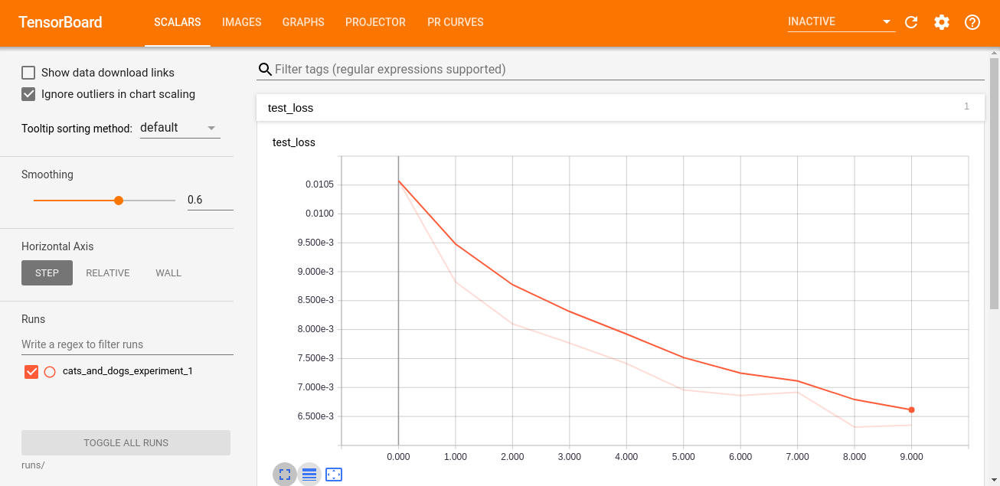
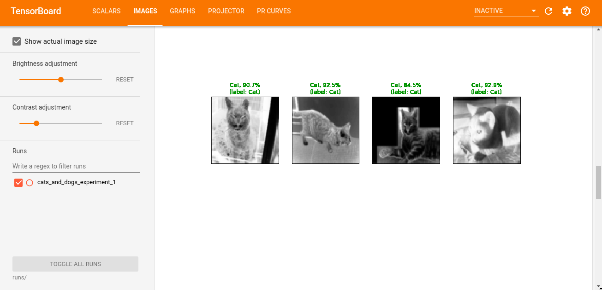

# Cats And Dogs Image Classification in Pytorch
--------------------------------

The Dogs vs. Cats dataset is a standard computer vision dataset that involves classifying photos as either containing a dog or cat.Our basic task is to create an algorithm to classify whether an image contains a dog or a cat. The
input for this task is images of dogs or cats from training dataset, while the output is the classification
accuracy on test dataset.[[1]](https://sites.ualberta.ca/~bang3/files/DogCat_report.pdf)

## Installation
---------------------
  
    - pip
    >> pip install -r requirement.txt

    - Conda
    >> conda env create -f environment.yml
    >> conda activate cats_and_dogs
    
 
## Downloading Dataset
---------------------

    >> cd data
    >> bash download.sh

    
## Usage
  
    >> python main.py -h
       usage: main.py [-h] [-file_dir FILE_DIR] [-batch_size BATCH_SIZE] [-lr LR]
              [-epoch EPOCH] [-model {SIMPLE,DEEPER}]

    #Example

    >> python main.py -epoch 10 -model 'DEEPER'
    
   
   
## Tensorboard Visualizations
------------------------

    >> tensorboard --logdir='TensorBoard/runs/'

### Images
----------------

### Architecture
----------------

### Train and test Loss
----------------

### Visualizations
------------------

### Output
----------------

### Output
----------------

